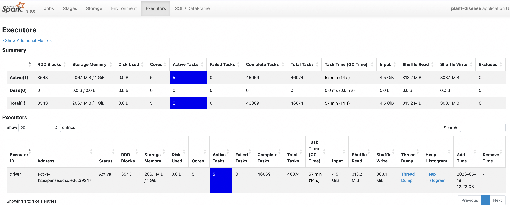

# Spark-232-Diseased-Plants
**Abstract**

As our climate changes drastically, the vitality of crops becomes unstable. With disease spreading and ravaging the world’s crops, there has to be a way to identify diseased plants at a large scale. Machine learning methods have been used to classify images of handwritten digits, faces, and X-rays. We can apply similar techniques to images of plants as well. In this project, binary image classification of diseased versus healthy plants and multiclass image classification of different types of plants are performed. The data used is a 19.47 GB dataset from Kaggle containing images of 13 diseased and healthy plants. A distributed processing method is used due to the dataset's large size and the need to preprocess and work with thousands of images. This project will help deepen the understanding of how machine learning algorithms can play an important role in disease detection and potentially be vital to humanity's survival. 

Link to Dataset: https://www.kaggle.com/datasets/samareshkumar/multipleplantdiseases

**Pre-Processing The Data**

From the exploratory analysis, we found that there is no missing data in our dataset; therefore, no preprocessing needed to be done in that regard. 

We first created new, clean columns for the labels. Next, we split our data into train, validation, and test sets. There are large imbalances in our dataset. For example, tomato images dominate but there are not many chili or cauliflower images in comparison. Similarly, there are many more diseased plant images than healthy plant images. Because of this, we made sure that all of the classes were represented in our train, validation, and test sets by using stratified random sampling.

To further address this data imbalance, we created a new weights column in our training datasets. We use this in our models to penalize mistakes on the minority class more heavily. We also label encoded our labels columns. Finally, all images were resized to the same dimensions before training. We created a pandas UDF to access the images, resize them, and store the resized versions as bytes in the dataframe using .withColumn(). 

**First Distributed Model**

[Link to Diseased Plants Preprocessing + First Model Notebook](https://github.com/dessiejohnson/Spark-232-Diseased-Plants/blob/Milestone3/Diseased%20Plants%20Preprocessing%20%2B%20First%20Model.ipynb)

For our first model, we wanted to implement a binary classification model to determine whether or not a plant is diseased. To achieve this, we utilized xgboost.spark.XGBoostClassifier as our distributed implementation model. 

During our validation stage, we tested different versions of hyper parameters to train our model and utilize the best performing hyperparameter model on the test set.
  - Hyperparameter Option 1: num_round=100, eta=0.1, num_workers=4
    - AUC: 0.9263584845703003 (validation)
  - Hyperparameter Option 2: num_round=50, eta=0.5, num_workers=4
    - AUC: 0.9380689481675041 (validation)
    - AUC: 0.9999996413209137 (training)
    - AUC: 0.9388896534991906 (test)
    - Given the overall trend of high AUC, the model seems to be slightly overfitting the data. Which is fairly common with a XGBoost model as they tend to pick up patterns
      extremely well.
  - Hyperparameter Option 3: num_round=50, eta=0.5, num_workers=1
    - AUC: 0.9380689481675041 (validation)
    - Note: Only change in Option 2 & 3 is num_workers due to need to create baseline for speed up

Both were evaluated by utilizing a BinaryClassificationEvaluator that calculated areaUnderROC. Option 1 & 2 having been given significant changes in num_round and eta, the options still yielded similar results with a slight improvement in Option 2. Likely due to differing priorities, option one calculates on a large amount of small tree/stumps and option 2 is based on a lower amount of larger trees. The swap in priorities likely served to help balance each other out. While Option 2 & 3 yield the same AUC value, however with different time outputs.

For our Milestone 4, we are thinking of implementing a Multiclassification model for the species of plant. Another large component to our Plant Disease data is plant type. Throughout the model there are # different species of plant life defined, therefore our goal is to create a classifier to accurately predict species. Please note that a separate pre-processing for the species is included in .ipynb file comment out at end of notebook as it does not pertain to the current model.

Overall, the model performs well with high accuracy. However, does not generalize quite as well, given extremely high train performance with a small but significant drop off with validation and test. There is always room for improvement to better fine tune the model and produce more accurate output. For example, a deeper dive into hyperparameter testing during the validation stage could be beneficial, however there’s also the issue of memory and time. Alternatively, conducting the model using Ray instead of Spark to be more efficient.

**Speedup Analysis**

| Executors | Time (sec) | Speedup | Efficiency |
|-----------|------------|---------|------------|
| 1 | 835.4 | 1.00x | 100% |
| 4 | 916.6 | 0.91x | 23% |

Conducted speed up analysis on XGBoost options 2 & 3, both initialized with same seed. Time is calculated from: model set hyperparameters -> fitting to train data -> predictions on validation -> evaluation. Speed up analysis indicates a decrease in both speed up and efficiency as num_workers is increased. Likely due to the choice of utilized Spark which can be inefficient compared to its Rey counterpart. The model runs on cores and does not utilize executors set in Spark.builder. It may be worth exploring how a Rey model might better perform.

**Spark UI Verification**

Ran 4 executors with 32g of memory each.

### Second Model

[LINK TO NOTEBOOK](https://github.com/dessiejohnson/Spark-232-Diseased-Plants/blob/73cc8aeae66f6a1162237187c96a07aebd91dd89/Diseased%20Plants%20Model2.ipynb)

For our second model, we used dimensionality reduction followed by a Random Forest Model to determine the species of the plants in the dataset. Principle Component Analysis (PCA) was used for the dimensionality reduction which was implemented with pyspark.ml.feature.PCA. The RandomForestClassifier from pyspark.ml.classification was used to implement the supervised ML model on the reduced-dimension features. A Logistic Regression model was initally implemented, but it did not perform very well which was why the RandomForestClassifier was implemented. However, both models provided insightful findings for our dataset.

The random forest model achieved a training accuracy of approximately 0.91 while the validation and test accuracies were both about 0.75. The gap between training and unseen data performance suggests hat the model is learning patterns in the training set that do not fully generalize to new samples. In contrast, the logistic regression model achieved approximately 0.61-0.64 accuracy across training, validation, and test sets, indicating more consistent but lower performance. 

Principal Component Analysis (PCA) retained k = 200 components, and had approximately 0.95 (95%) of the total variance in the original feature space. The high variance indicates that the dimensionality reduction preserved most of the important information in the dataset. However, high explained variance does not guarantee high classification performance, since PCA is unsupervised and does not preserve class-separating directions.

The random forest model is in the mild overfitting region with the high training score but moderate validation and test scores. The logistic regression model on the other hand is in the underfitting region with low scores in training, validation and test sets. This indicates insufficient model complexity to capture nonlinear relationships in our dataset.

Some future improvements that could be done for this model is used a more advanced model like Convolutional Neural Network (CNN) which will likely deliver better image classification accuracy. The results indicate that the dimensionality reduction with PCA reduced computational cost while retaining 95% variance. PCA likely improved model stability and efficiency. 

Further hyperparameter tuning will likely not improve the performance of either the random forest or logistic regression models based on the investigation done in this project. The first table below show the result accuracies for different parameters that were tested in the logistic regression model. The second table shows the accuracy results for different parameters of the random forest model.

| Parameter(s)       | Training Accuracy | Validation Accuracy | Test Accuracy |
|--------------------|-------------------|---------------------|---------------|
| k=10, 8x8 image    | 0.46              | 0.45                | 0.45          |
| k=100, 8x8 image   | 0.63              | 0.62                | 0.63          |
| k=100, 16x16 image | 0.61              | 0.61                | 0.60          |
| k=100, 24x24 image | 0.60              | 0.60                | 0.60          |
| k=300, 24x24 image | 0.66              | 0.62                | 0.63          |

| Parameter(s)              | Training Accuracy | Validation Accuracy | Test Accuracy |  PCA, image size   |
|---------------------------|-------------------|---------------------|---------------|--------------------|
| numTrees=50, maxDepth=8   | 0.70              | 0.62                | 0.63          | k=300, 24x24 image |
| numTrees=100, maxDepth=12 | 0.92              | 0.75                | 0.74          | k=300, 24x24 image |
| numTrees=100, maxDepth=10 | 0.84              | 0.70                | 0.71          | k=300, 24x24 image |
| numTrees=150, maxDepth=12 | 0.93              | 0.76                | 0.76          | k=300, 24x24 image |
| numTrees=100, maxDepth=14 | 0.97              | 0.77                | 0.78          | k=300, 24x24 image |
| numTrees=100, maxDepth=12 | 0.92              | 0.75                | 0.74          | k=300, 32x32 image |
| numTrees=100, maxDepth=12 | 0.92              | 0.75                | 0.75          | k=200, 24x24 image |

Higher accuracies in the random forest model came with the tradeoff of a longer training time. The Spark driver memory had to be increased from the recommended 2GB to 12GB for the model training to complete in a reasonable timeframe.

In total, 5913 images were correctly classified and 1945 images were classified incorrectly.

In conclusion, logistic regression served as a baseline but lacked the complexity required to capture nonlinear relationships in image-derived features. PCA effectively reduced dimensionality while preserving most variance. However, PCA + classical ML models reached a performance ceiling. To significantly improve performance, future work should focus on deep learning-based feature extraction (CNNs).
