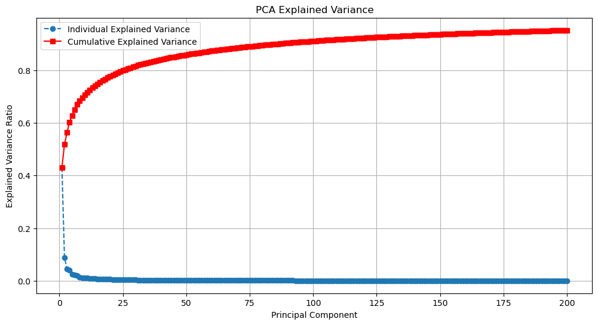
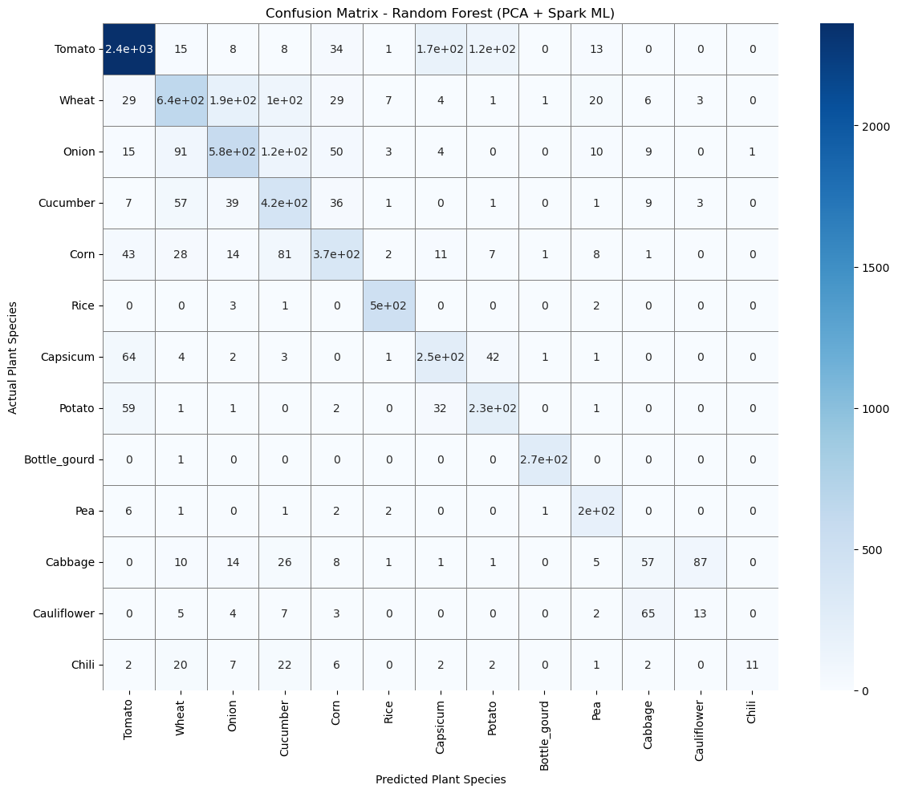

# DSC232R Spark Group Project: Diseased Plants
## Introduction
As our climate changes drastically, the vitality of crops becomes unstable. With disease spreading and ravaging the world’s crops, there has to be a way to identify diseased plants at a large scale. Machine learning methods have been used to classify images of handwritten digits, faces, and X-rays. We can apply similar techniques to images of plants as well. In this project, binary image classification of diseased versus healthy plants and multiclass image classification of different types of plants are performed. The data used is a 19.47 GB dataset from Kaggle containing images of 13 diseased and healthy plants. A distributed computing framework is used due to the dataset's large size and the need to preprocess and work with thousands of images. The dataset size makes traditional single-machine processing inefficient and difficult to scale. Spark enables distributed storage and parallel computation, allowing efficient preprocessing, scalable machine learning workflows, fault tolerance, and significantly reduced execution time.This project will help deepen the understanding of how machine learning algorithms can play an important role in disease detection and potentially be vital to humanity's survival.

Link to dataset: https://www.kaggle.com/datasets/samareshkumar/multipleplantdiseases

## Methods
### Data Exploration

### Pre-Processing

To begin preprocessing the data for model training, we created a Spark dataframe with four columns: file_path, class_label, plant, and disease. To create the class_label, plant, and disease columns, we split the file_path string at different parts to isolate what we needed. 

```python
metadata = spark.read.format("binaryFile") \
    .option("recursiveFileLookup", "true") \
    .load(data_path) \
    .withColumn("file_path", F.col("path")) \
    .withColumn("class_label", F.element_at(F.split("path", "/"), -2)) \
    .withColumn("plant", split.getItem(0)) \
    .withColumn("disease", split.getItem(1)) \
    .select("file_path", "class_label", "plant", "disease")
```

We created a new column called "disease_clean" to serve as the label for our binary classification problem addressed by Model 1. This new column strictly labeled an image as either healthy or diseased since the dataset originally included the specific disease type. The "plant" column served as the label for our multiclass classification problem addressed by Model 2.

```python
metadata = metadata.withColumn(
    "disease_clean",
    F.when(F.lower(F.col("disease")).rlike("healthy|fresh_leaf"), "healthy")
     .otherwise(F.col("disease"))
).withColumn("health", \
 F.when(F.lower(F.col("disease_clean"))== "healthy", "healthy").otherwise("diseased"))\
.select("file_path", "plant", "health").cache()
```

No null values were present in the dataset, so we moved on to splitting the data into training, validation, and test sets for each model. There were significant data imbalances; images of diseased plants vastly outnumbered images of healthy plants. Images of tomatoes were overrepresented while other plants like chilis and cauliflowers were severely underrepresented. To address this, we used stratified random sampling to ensure that the smaller classes were represented in our training dataset.

```python
w_d = Window.partitionBy("health").orderBy(F.rand(seed=1))
metadata_d = metadata.withColumn("row_num", F.row_number().over(w_d))\
            .withColumn("count", F.count("*").over(Window.partitionBy("health")))
metadata_d = metadata_d.withColumn("split", F.when(F.col("row_num") <= 0.7* F.col("count"), "train")\
            .when(F.col("row_num") <= 0.85 * F.col("count"), "val").otherwise("test"))
train_d = metadata_d.filter(F.col("split") == "train").select("file_path", "health")
val_d = metadata_d.filter(F.col("split") == "val").select("file_path", "health")
test_d = metadata_d.filter(F.col("split") == "test").select("file_path", "health")
```

Next, we label encoded. Because of the data imbalance, we also added a new column to the training datasets only. For the binary classification problem, we added a “weight” column that weighted the minority class, healthy plant images, more than the majority class. For the multiclass classification problem, we added a “weight” column that weighted the minority classes like chili, cauliflower, and cabbage more strongly. These new columns would be used when training the models.

```python
class_counts_d = train_d.groupBy("label").count()

total_d = train_d.count()
num_classes_d = class_counts_d.count()

weights_d = class_counts_d.withColumn(
    "weight",
    F.lit(train_d.count()) / (F.lit(class_counts_d.count()) * F.col("count"))
).select("label", "weight")

train_d = train_d.join(weights_d, on="label", how="left")
 ```

Finally, we preprocessed the images. We brought in the image data and joined them to our train, validation, and test sets. We used a pandas UDF to ensure all images were the same size and correct format for the models by resizing, normalizing, and flattening the images into vectors. 

```python
@pandas_udf(ArrayType(FloatType()))
def decode_image(contents: pd.Series) -> pd.Series:
    result = []

    for content in contents:
        try:
            img = Image.open(io.BytesIO(content)).convert("RGB")
            # small because im having memory/speed problems
            img = img.resize((32,32))
            arr = np.asarray(img, dtype = np.float32) / 255.0
            result.append(arr.reshape(-1).tolist())
        except Exception:
            result.append(None)

    return pd.Series(result)
 ```

### Model 1

### Model 2

For our second model, we used dimensionality reduction followed by a Random Forest Model to determine the species of the plants in the dataset. Principle Component Analysis (PCA) was used for the dimensionality reduction. The parameter k=200 was chosen for the number of components and it was fitted to the training data. Then the PCA model was applied to the training, validation and test datasets.

```python
pca = PCA(k=200, inputCol="features", outputCol="pca_features")
pca_model = pca.fit(train_s)
train_pca = pca_model.transform(train_s)
val_pca = pca_model.transform(val_s)
test_pca = pca_model.transform(test_s)
```
After dimensionality reduction, a logistic regression model was initially trained on the dataset with a maxIter=20. However, due to the poor performance of the model performance, a random forest model was implemented. The random forest model was trained with numTrees=100 and maxDepth=12.

```python
lr = LogisticRegression(
    featuresCol='pca_features',
    labelCol='label',
    weightCol='weight',
    maxIter=20,
    regParam=0.01
)
```
```python
rf = RandomForestClassifier(
    featuresCol='pca_features',
    labelCol='label',
    weightCol='weight',
    numTrees=100,
    maxDepth=12,
    seed=1
)
```
Both models were evaluated using multiclass classification evaluator to calculate the training, validation and test accuracies.

```python
evaluator_lr = MulticlassClassificationEvaluator(
    labelCol='label',
    predictionCol='prediction',
    metricName='accuracy'
)

train_acc_lr = evaluator_lr.evaluate(train_pred_lr)
val_acc_lr = evaluator_lr.evaluate(val_pred_lr)
test_acc_lr = evaluator_lr.evaluate(test_pred_lr)
```
Analysis of the PCA reduction was done by calculating the explained variance and a scree plot to show the contribution of the PCA components.

```python
explained_variance = pca_model.explainedVariance.toArray()
total_variance = explained_variance.sum()
cumulative_variance = np.cumsum(explained_variance)

plt.plot(
    range(1, len(explained_variance)+1),
    explained_variance,
    marker='o',
    linestyle='--',
    label='Individual Explained Variance'
)
```
Lastly, the performance of the random forest model was evaluated with a confusion matrix to show what plants had the most incorrect classifications.

```python
conf_pd = (
    test_pred_rf
    .select("label", "prediction")
    .groupBy("label", "prediction")
    .count()
    .toPandas()
)

conf_matrix = conf_pd.pivot(
    index="label",
    columns="prediction",
    values="count"
).fillna(0)

labels = le_s.labels
conf_matrix.index = labels
conf_matrix.columns = labels
```

## Results
### Model 1

### Model 2

The random forest model achieved a training accuracy of approximately 0.91 while the validation and test accuracies were both about 0.75. In contrast, the logistic regression model achieved approximately 0.61-0.64 accuracy across training, validation, and test sets. The PCA scree plot showed that approximately the first two principle component preserved approximately 55% of the dataset information. There is a sharp drop off ('elbow') after the sixth principle component. The cummulative explained variance plot indicates that 200 principle components retained approximately 95% of the total variance which shows PCA effectively reduced dimensionality while preserving most image information.



The first table below show the result accuracies for different parameters that were tested in the logistic regression model. The second table shows the accuracy results for different parameters of the random forest model.

| Parameter(s)       | Training Accuracy | Validation Accuracy | Test Accuracy |
|--------------------|-------------------|---------------------|---------------|
| k=10, 8x8 image    | 0.46              | 0.45                | 0.45          |
| k=100, 8x8 image   | 0.63              | 0.62                | 0.63          |
| k=100, 16x16 image | 0.61              | 0.61                | 0.60          |
| k=100, 24x24 image | 0.60              | 0.60                | 0.60          |
| k=300, 24x24 image | 0.66              | 0.62                | 0.63          |

| Parameter(s)              | Training Accuracy | Validation Accuracy | Test Accuracy |  PCA, image size   |
|---------------------------|-------------------|---------------------|---------------|--------------------|
| numTrees=50, maxDepth=8   | 0.70              | 0.62                | 0.63          | k=300, 24x24 image |
| numTrees=100, maxDepth=12 | 0.92              | 0.75                | 0.74          | k=300, 24x24 image |
| numTrees=100, maxDepth=10 | 0.84              | 0.70                | 0.71          | k=300, 24x24 image |
| numTrees=150, maxDepth=12 | 0.93              | 0.76                | 0.76          | k=300, 24x24 image |
| numTrees=100, maxDepth=14 | 0.97              | 0.77                | 0.78          | k=300, 24x24 image |
| numTrees=100, maxDepth=12 | 0.92              | 0.75                | 0.74          | k=300, 32x32 image |
| numTrees=100, maxDepth=12 | 0.92              | 0.75                | 0.75          | k=200, 24x24 image |

Higher accuracies in the random forest model came with the tradeoff of a longer training time. The Spark driver memory had to be increased from the recommended 2GB to 12GB for the model training to complete in a reasonable timeframe.

In total, 5913 images were correctly classified and 1945 images were classified incorrectly.



## Discussion
For preprocessing, we waited to bring in the image data until the final step before starting the model building. This way, we could do transformations on the data like stratified random sampling and splitting into the train, validation, and test sets more efficiently. The majority of the size of the dataset came from the images, so until we needed to use the data for the model building, we left it out.


## Conclusion
We learned that big data processing requires time. Even simply loading in the data required much more time than expected. Because of this, we had to think and act more carefully when it came to checking our work and tuning the models. Attempting to count the total number of null values to check our work, which would be a simple task in normal data preprocessing, might cause an out-of-memory error or timeout. Adjusting model parameters and retraining could be painstakingly slow. So, we had to think carefully about what we wanted to run.

The HPC server provided a convenient development environment through centralized management and access to pre-installed packages. Nevertheless, competition for computing resources sometimes introduced delays, which needed to be considered when establishing project timelines.

We would like to explore different ways of preprocessing the image data, like using pretrained embeddings such as ResNet rather than our current approach. This may increase our model performance.  


## Statement of Collaboration
| Name            | Title                          | Contribution                               |
|-----------------|--------------------------------|--------------------------------------------|
| Desirè Johnson  | Project Manager, Writer, Coder | Abstract, data exploration, final report   |
| Angela Fan      | Writer, Coder                  | Abstract, pre-processing, final report     |
| Megan Felix     | Coder, Writer                  | Model 1, final report                      |
| Ashley Chong    | Coder, Writer                  | Model 2, final report                      |

